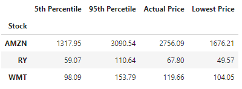
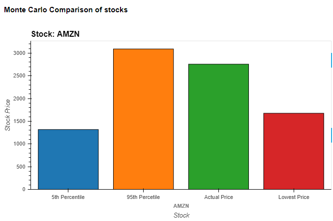
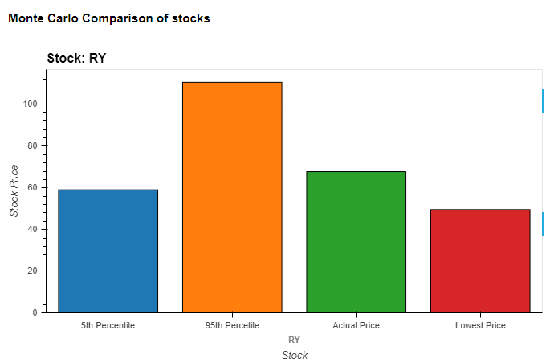
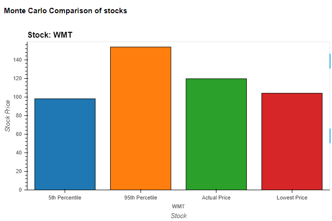
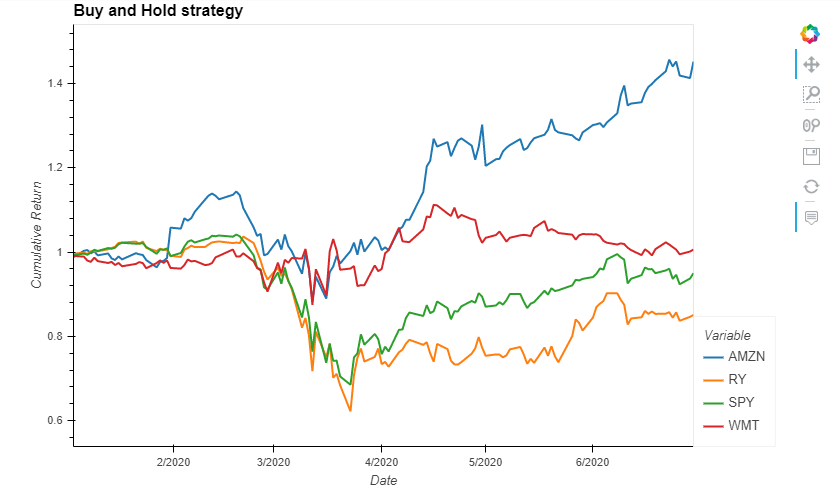
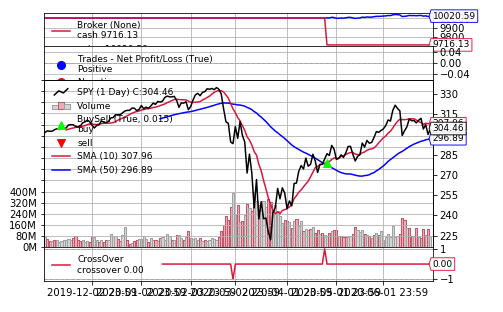

# Project 1
## Group #4 - Bailey Cameron, Daphene Lobo, Elizabeth Morris, Veldurai Lakshmanan

### Requirements

 <u>Libraries</u>
 
Please install the following libraries before running the Jupyter Notebook named Project_1.
* Alpaca Trade Api *[pip install alpaca-trade-api]*
* Yahoo Finance *[pip install yahoo-finance]*
* Backtrader *[pip install backtrader]*

<u>APIs</u>

The following API keys will be required:
* Aplaca API keys 
* Financial Modeling Prep API.
https://financialmodelingprep.com/developer/docs/

### <u>Presentation</u>

Click on this link to access the presentation slides.

https://prezi.com/or4sifdx7mdx/?utm_campaign=share&utm_medium=copy

### <u>Summary</u>

* Black Swan Events disrupt different sectors of the economy in different ways. The financial sector took a big hit this year, retail stayed the same; E-commerce grew significantly.

* Can Monte Carlo Simulations foresee black swan events? 

As per our findings, Monte Carlo simulations are pretty accurate. Due to COVID-19, the RBC stock fell below the 5th percentile range projected by the Monte Carlo simulation, but quickly recovered.

* What was the best strategy for investors who had money in the market during the crisis? 

Long-term investors using the buy & hold strategy can wait out the crisis. The market seems to have already recovered since the initial slump in Mar/Apr.

* If an investor is looking to enter the market, are there any buy/sell signals, they should be aware of?

Using a new financial library called Backtrader, we have found that investors can use the small moving averages cross-over strategy, to gauge a good time to buy/sell. When the shorter-term MA crosses above the longer-term MA, it's a buy signal, as it indicates that the trend is shifting up. This is known as a "golden cross." Meanwhile, when the shorter-term MA crosses below the longer-term MA, it's a sell signal, as it indicates that the trend is shifting down. This is known as a "dead/death cross."

For example, below is the graph for the SPY index. You can see there is a buy signal around April 1st, 2020 and a sell signal coming up in the near future.

Please refer to the Jupyter Notebook and the Pyviz Dashboard for the complete set of images and graphs related to our project.

## Thank You!!! :)